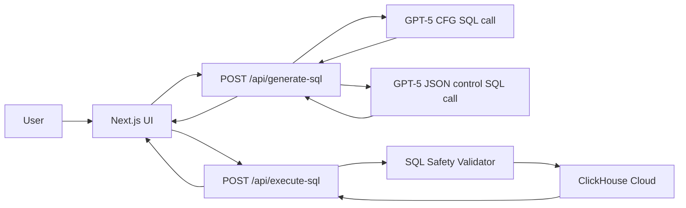

# System Design and Tech Spec

## Goal

Build a deployed natural-language analytics app that lets a user ask questions about a ClickHouse dataset and see the returned data. The app must use GPT-5 Context Free Grammar support to constrain generated ClickHouse SQL, include at least three evals for CFG generation, and deploy as a small web app.

## Dataset

Use the pre-imported ClickHouse Cloud example New York taxi dataset. We intentionally do **not** implement CSV ingestion; the demo relies on the dataset that ships pre-loaded in ClickHouse Cloud, and database setup/credentials are provided externally. The live SQL surface targets `default.nyc_taxi`; environments can point the same grammar shape at `${CLICKHOUSE_DATABASE}.${CLICKHOUSE_TABLE}` when those env vars identify the sample table.

```sql
default.nyc_taxi (
    trip_id             UInt32,
    pickup_datetime     DateTime,
    dropoff_datetime    DateTime,
    pickup_longitude    Nullable(Float64),
    pickup_latitude     Nullable(Float64),
    dropoff_longitude   Nullable(Float64),
    dropoff_latitude    Nullable(Float64),
    passenger_count     UInt8,
    trip_distance       Float32,
    fare_amount         Float32,
    extra               Float32,
    tip_amount          Float32,
    tolls_amount        Float32,
    total_amount        Float32,
    payment_type        Enum('CSH' = 1, 'CRE' = 2, 'NOC' = 3, 'DIS' = 4, 'UNK' = 5),
    pickup_ntaname      LowCardinality(String),
    dropoff_ntaname     LowCardinality(String)
)
```

This dataset is demo-friendly because it has timestamps, money fields, categories, and intuitive analytics questions. The example prompts throughout this spec (including "last 30 hours") are illustrative of the *kind* of questions the app handles, not fixed requirements to build toward. Because the data is historical, the default demo behavior should interpret relative time windows against the latest timestamp in the dataset rather than wall-clock `now()`. For example, "last 30 hours" should map to:

```sql
pickup_datetime >= (SELECT max(pickup_datetime) FROM default.nyc_taxi) - INTERVAL 30 HOUR
```

## Architecture



## Tech Stack

- Framework: Next.js with TypeScript.
- Hosting: Vercel.
- Model API: OpenAI Responses API with GPT-5 custom tool calling and grammar format. Default to `OPENAI_MODEL=gpt-5-nano` for the cheapest CFG-capable path; promote to `gpt-5-mini` if live evals show routing quality is not reliable enough.
- Database client: `@clickhouse/client`.
- Test runner: a simple TypeScript eval script run with `tsx`, optionally wrapped by `pnpm eval`.
- Styling: minimal CSS or Tailwind, depending on the scaffold defaults.

## App Behavior

The main page should provide:

- A textarea for a natural-language question.
- Example prompt buttons for reliable demo queries.
- A submit button with loading, error, and rejection states for SQL generation.
- A generated SQL preview before execution.
- A non-CFG SQL comparison preview that is clearly labeled display-only.
- A separate button to run the proposed SQL against ClickHouse.
- A results table for returned ClickHouse rows.
- A clear rejection message when the question is out of scope (no SQL is generated or executed).
- A small metadata area showing execution duration and row count.

Example prompts:

- "Sum the total amount for taxi trips in the last 30 hours."
- "Show average tip amount by payment type."
- "Top 10 pickup neighborhoods by total revenue."
- "Count trips with more than 2 passengers in the last 7 days."

## Backend API

Generate endpoint:

```text
POST /api/generate-sql
```

Request:

```json
{
  "question": "Sum the total amount for taxi trips in the last 30 hours."
}
```

Response:

```json
{
  "cfg": {
    "question": "Sum the total amount for taxi trips in the last 30 hours.",
    "sql": "SELECT sum(total_amount) FROM default.nyc_taxi WHERE pickup_datetime >= (SELECT max(pickup_datetime) FROM default.nyc_taxi) - INTERVAL 30 HOUR;"
  },
  "control": {
    "sql": "SELECT sum(total_amount) FROM default.nyc_taxi WHERE pickup_datetime >= now() - INTERVAL 30 HOUR;",
    "notes": "Non-CFG comparison query; shown for display only."
  }
}
```

Rejection response (question is out of scope — the model did not call the tool):

```json
{
  "cfg": {
    "rejected": true,
    "message": "That question can't be answered with the supported taxi trip analytics."
  },
  "control": {
    "sql": "SELECT min(pickup_datetime), max(pickup_datetime) FROM default.nyc_taxi;",
    "notes": "Uses min/max timestamps to answer the requested dataset range."
  }
}
```

Error response (unexpected failure, or a tool call that fails safety validation):

```json
{
  "cfg": {
    "error": "Unable to generate a supported read-only query."
  },
  "control": {
    "error": "Unable to generate comparison SQL."
  }
}
```

Execute endpoint:

```text
POST /api/execute-sql
```

Request:

```json
{
  "question": "Sum the total amount for taxi trips in the last 30 hours.",
  "sql": "SELECT sum(total_amount) FROM default.nyc_taxi WHERE pickup_datetime >= (SELECT max(pickup_datetime) FROM default.nyc_taxi) - INTERVAL 30 HOUR;"
}
```

Response:

```json
{
  "question": "Sum the total amount for taxi trips in the last 30 hours.",
  "sql": "SELECT sum(total_amount) FROM default.nyc_taxi WHERE pickup_datetime >= (SELECT max(pickup_datetime) FROM default.nyc_taxi) - INTERVAL 30 HOUR;",
  "rows": [{ "sum(total_amount)": 12345.67 }],
  "rowCount": 1,
  "durationMs": 215
}
```

The server re-validates SQL in `POST /api/execute-sql` before executing it, even
though the SQL was already generated and validated by `POST /api/generate-sql`.
Only `cfg.sql` is executable. `control.sql` is generated by a non-CFG JSON-only
model call for side-by-side comparison and is never accepted by the execution UI.

## GPT-5 CFG Integration

Use GPT-5 custom tool calling with a Lark grammar:

```ts
model: process.env.OPENAI_MODEL ?? "gpt-5-nano",
tools: [
  {
    type: "custom",
    name: "clickhouse_sql",
    description:
      "Generate exactly one read-only ClickHouse SELECT query for default.nyc_taxi. Use only allowed columns, aggregations, filters, grouping, ordering, and limits. The output must obey the grammar. Only call this tool when the user's question can be answered by a query within the supported surface area; otherwise do not call it.",
    format: {
      type: "grammar",
      syntax: "lark",
      definition: clickhouseSqlGrammar,
    },
  },
],
tool_choice: "auto",
parallel_tool_calls: false,
reasoning: { effort: "medium" },
```

### Non-CFG control SQL

`POST /api/generate-sql` also makes a second OpenAI call in parallel without CFG
constraints. This output is for comparison only and is not executable through the
UI. The control prompt asks for JSON only:

```text
You are a text-to-SQL assistant for ClickHouse.

Table: default.nyc_taxi

Columns:
- pickup_datetime
- dropoff_datetime
- passenger_count
- trip_distance
- fare_amount
- tip_amount
- total_amount
- payment_type
- pickup_ntaname
- dropoff_ntaname

Return JSON only in this shape:
{
  "sql": "SELECT ...;",
  "notes": "brief explanation of assumptions"
}

Rules:
- Generate one ClickHouse SQL query.
- Return read-only SELECT queries.
- Do not wrap the JSON in Markdown.
```

### Rejecting out-of-scope questions

The app must reject questions it cannot answer rather than forcing a misleading query. The tool call is therefore **not** forced (`tool_choice: "auto"`), so the model has two outcomes:

- **In scope** → the model emits a `clickhouse_sql` custom tool call. The API route extracts the tool call input as the generated SQL, runs the safety validator, and executes it.
- **Out of scope** → the model returns plain text instead of a tool call. The API route treats the absence of a tool call as a rejection and returns a rejection response (see Backend API).

The system/developer prompt should instruct the model to only call `clickhouse_sql` for analytics questions over the taxi trips dataset that fit the supported surface area, and to otherwise reply briefly explaining it cannot answer. Because the grammar still constrains every emitted query, any tool call that does occur is guaranteed grammar-valid.

## SQL Surface Area

Keep the grammar intentionally narrow. Support these query families first:

- Single aggregate:
  - `count()`
  - `sum(total_amount)`
  - `avg(total_amount)`
  - `sum(fare_amount)`
  - `avg(tip_amount)`
  - `avg(trip_distance)`
- Grouped aggregate by:
  - `payment_type`
  - `pickup_ntaname`
  - `dropoff_ntaname`
  - `passenger_count`
- Filters:
  - relative dataset time window on `pickup_datetime`
  - `payment_type = 'CSH' | 'CRE' | 'NOC' | 'DIS' | 'UNK'`
  - `passenger_count` comparisons
  - `trip_distance` comparisons
  - `total_amount` comparisons
- Ordering:
  - aggregate result ascending or descending
- Limit:
  - integer limit for grouped result sets

## Initial Grammar Sketch

The full Lark grammar lives in [clickhouse-sql-grammar.md](/Users/jerrylai/git/cursor-sandbox-gpt/clickhouse-sql-grammar.md). It is the intended starting point, not the final grammar, and should be validated against the OpenAI API and simplified if the API rejects it.

Two correctness decisions are baked into that grammar: grouped queries are expanded as one rigid template per group column so the projection and `GROUP BY` columns always match, and `ORDER BY` is limited to the aggregate so the result can never sort by an ungrouped column. `NUMBER` and `DECIMAL` are disjoint (`DECIMAL` requires a dot) to avoid greedy-lexer ambiguity.

## Grammar Validation

Grammar correctness is tested deterministically, **without** involving the LLM, so we are not "taking the model's word for it." There are three independent layers:

1. **Deterministic accept/reject corpus (no AI).** Compile the exact grammar with the same engine OpenAI uses — [LLGuidance](https://github.com/guidance-ai/llguidance) — and assert a hand-written corpus of strings parses or fails as expected. The simplest path is the `guidance-lark-mcp` tool (`uvx guidance-lark-mcp`), which exposes `validate_grammar` (checks the grammar compiles and is internally consistent) and `run_batch_validation_tests` (runs a JSON corpus of `{ "input": "...", "should_parse": true|false }` cases and returns pass/fail). Equivalent options: the `llguidance` Python package, its `sample_parser` Rust CLI, or the `lark` Python parser. We standardize on LLGuidance because Lark-the-parser and LLGuidance-the-constrainer can diverge, and LLGuidance is what actually constrains sampling in the API.

   The corpus must include **negative** cases that prove the grammar rejects what it should, e.g.:
   - `SELECT * FROM default.nyc_taxi;` → should_parse: false
   - `DROP TABLE default.nyc_taxi;` → should_parse: false
   - `SELECT payment_type, sum(total_amount) FROM default.nyc_taxi GROUP BY pickup_ntaname;` → should_parse: false (projection/GROUP BY mismatch)
   - `SELECT sum(total_amount) FROM default.nyc_taxi;` → should_parse: true

2. **Live API acceptance.** Submit the grammar to the OpenAI API once (any trivial prompt). The API rejects grammars that are too complex, so this confirms the grammar is usable at all. This needs only `OPENAI_API_KEY`, not ClickHouse, so it runs early (see plan Phase 2 spike).

3. **Execution against ClickHouse.** Every accepted string is *parser*-valid by construction; that does not prove it is *semantically* valid SQL. Executing representative accepted queries against ClickHouse is what catches grammar bugs that produce parseable-but-invalid SQL (e.g. a column not under an aggregate). A non-empty/sane result also validates the dataset-relative-time logic.

This is the answer to "is there an external, non-AI validator": yes — layers 1 and 3 are fully deterministic and independent of the model.

## SQL Safety

The grammar is the first safety layer, but the backend should also validate SQL before execution:

- Must start with `SELECT`.
- Must end with exactly one semicolon.
- Must not contain forbidden keywords: `INSERT`, `UPDATE`, `DELETE`, `DROP`, `ALTER`, `TRUNCATE`, `CREATE`, `SYSTEM`, `GRANT`, `REVOKE`, `ATTACH`, `DETACH`, `OPTIMIZE`.
- Must reference only `default.nyc_taxi`.
- Must reference only allowed columns and functions.
- Must not contain comments.
- Must not contain multiple statements.

ClickHouse credentials should use a readonly user if possible.

## Evals

These LLM evals test a different thing than the Grammar Validation section. They measure whether the model **routes** a natural-language question to the right query shape (did it pick `sum(total_amount)` + a time filter, did it reject an out-of-scope question). They do **not** prove the grammar is correct: every tool call the model emits is grammar-valid by construction, so "the output matches the grammar" is tautological. Grammar correctness is established separately and deterministically by the accept/reject corpus and ClickHouse execution described under Grammar Validation. Keep the two suites distinct.

Add a simple eval runner under `evals/run-evals.ts`.

Each in-scope eval should:

1. Send a natural-language prompt to GPT-5 with the CFG tool.
2. Assert that the response includes a `clickhouse_sql` custom tool call.
3. Extract the SQL and run the safety validator.
4. Execute the SQL against ClickHouse when credentials are present (at least one eval should execute and assert a sane, non-empty result to protect the dataset-relative-time logic).
5. Check the SQL contains expected structural elements.

Rejection evals should instead assert that the model returned **no** tool call (the out-of-scope path).

Initial eval cases:

- Prompt: "Sum the total amount for taxi trips in the last 30 hours."
  - Expected: `sum(total_amount)`, time filter, no group by.
- Prompt: "Show average tip amount by payment type."
  - Expected: `avg(tip_amount)`, `GROUP BY payment_type`.
- Prompt: "Top 10 pickup neighborhoods by total revenue."
  - Expected: `pickup_ntaname`, `sum(total_amount)`, `GROUP BY pickup_ntaname`, `ORDER BY`, `LIMIT 10`.
- Prompt: "Count trips with more than 2 passengers in the last 7 days."
  - Expected: `count()`, `passenger_count > 2`, time filter.
- Prompt (rejection): "What's the weather in Paris tomorrow?"
  - Expected: no `clickhouse_sql` tool call; the app returns a rejection.

## Environment Variables

```text
OPENAI_API_KEY=
OPENAI_MODEL=gpt-5-nano
CLICKHOUSE_HOST=
CLICKHOUSE_USERNAME=
CLICKHOUSE_PASSWORD=
CLICKHOUSE_DATABASE=default
CLICKHOUSE_TABLE=nyc_taxi
```

## Deployment

Deploy to Vercel:

- Add all environment variables in the Vercel project settings.
- Use the default Next.js build command.
- Keep ClickHouse host access open to Vercel or configure the required allowlist.
- Run evals locally before deploy and against the deployed API after deploy.

## Risks and Mitigations

- Historical dataset makes "last 30 hours" confusing.
  - Use dataset-relative time in generated SQL by default.
- Lark grammar may be rejected if it is too complex.
  - Start with two or three rigid query templates and expand only after evals pass.
- SQL may be syntactically valid but semantically awkward.
  - Keep example prompts visible in the UI and add evals for expected demo flows.
- An out-of-scope question could be forced into a misleading query.
  - Do not force the tool call (`tool_choice: "auto"`); treat a missing tool call as an explicit rejection and surface it in the UI.
- Generated SQL could still be unsafe if validation is skipped.
  - Use CFG, backend validation, and readonly ClickHouse credentials together.

